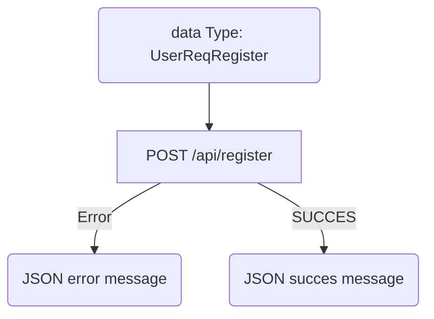
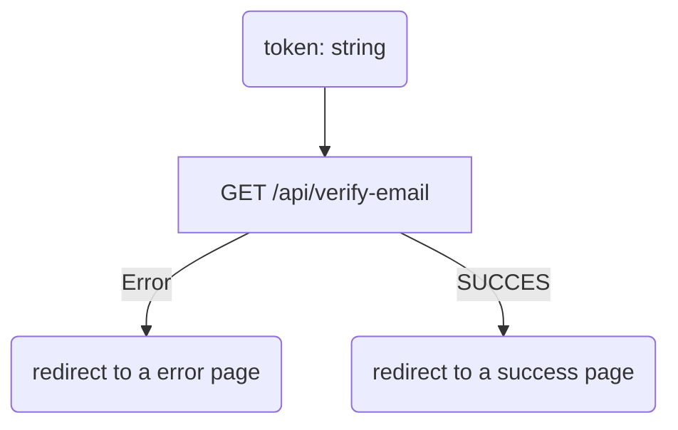
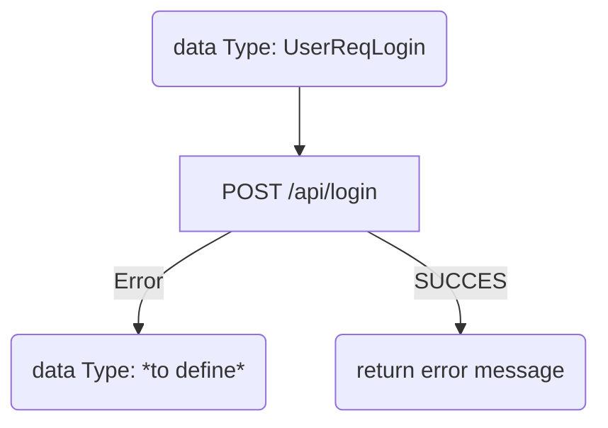
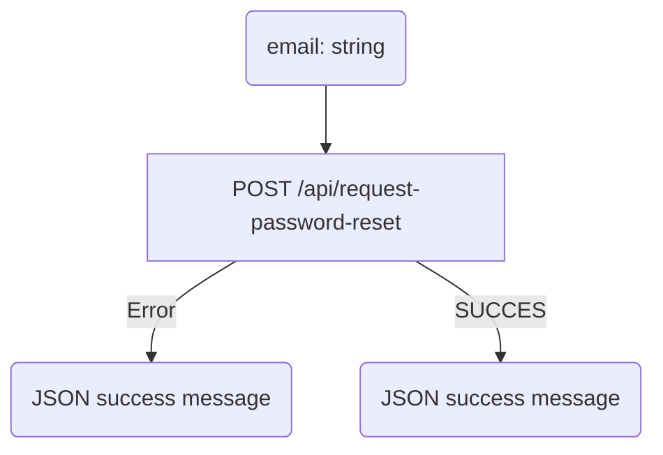
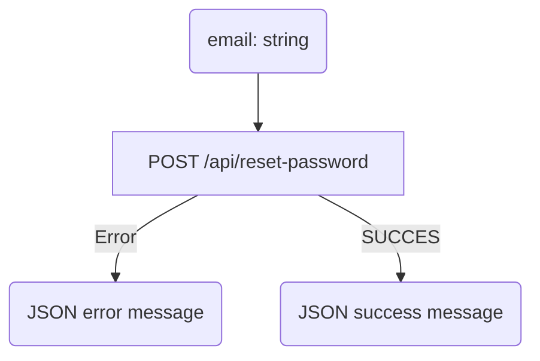
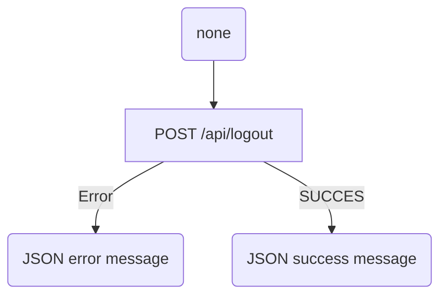

# Matcha project

## Route 
data Type can be found in comon_src/type
### user register:
creat new profile

### validate email:
give to user a way to become validate

*
### user login:
give all data needed to use website as a loged user

Returns: Upon successful login, return a JSON object with a success message and a user session or JWT token. In case of an error (e.g., incorrect credentials), return an error message.

### ask for reset password:
creat a token send it via mail and stor it

return a JSON object with a success message

### reset password:
check if token is correct and change password

### logout:
unvalidate token data in server side

## 42 project
### by hutricot and alabalet